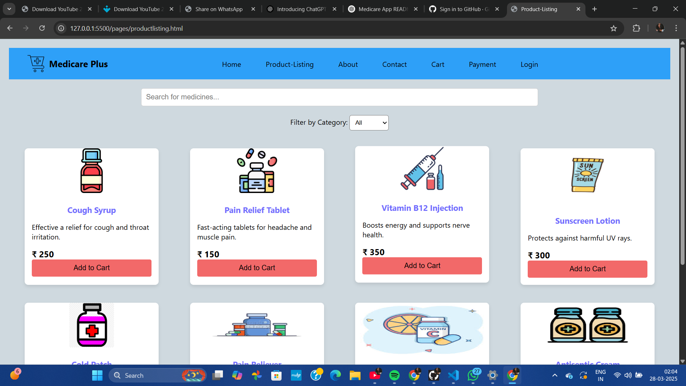

# Medicare App
---
## Overview
Medicare App is a healthcare management system designed to provide seamless medical services to patients and healthcare providers. The app allows users to book appointments, access medical records, receive prescription reminders, and consult with doctors online.
---
## Features
- **User Authentication**: Secure login and registration system.
- **Appointment Booking**: Schedule and manage doctor visits.
- **Medical Records**: View and update personal health history.
- **Prescription Reminders**: Get notifications for medication schedules.
- **Teleconsultation**: Video and chat-based doctor consultations.
- **Health Tips & Articles**: Stay informed with the latest health news.
---

---
